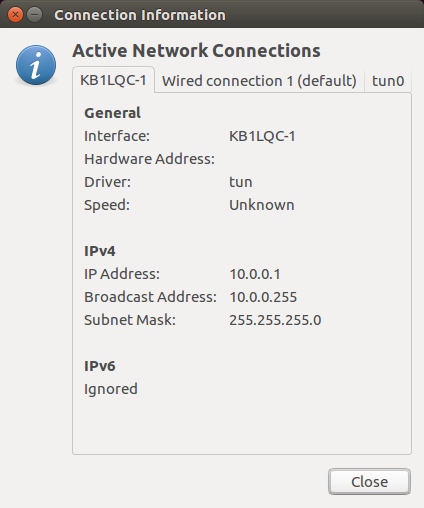

# faradayio-cli
[](https://travis-ci.org/FaradayRF/faradayio-cli) [](https://gitter.im/FaradayRF/Lobby)

The `faradayio-cli` package provides a command line implementation of the [`faradayio`](https://github.com/FaradayRF/faradayio) module. Like the `faradayio` module this program is also radio agnostic and will work with any RF module that accepts serial port SLIP encoded IP frames. Running `faradayio-cli` results in a TUN/TAP adapter being implemented which persists as long as the program is running. This module then redirects any packets destined for the IP range assigned to the TUN/TAP adapter to the serial port specified.

The main use of `faradayio-cli` is to provide access to the FaradayRF Faraday radio using standard IP packets. It makes the Faraday radio appear as a normal network interface. Below is an example of `faradayio-cli` providing a network interface `KB1LQC-1` for IP addresses `10.0.0.1` through `10.0.0.255` where the TUN adapter itself is located `10.0.0.1`.


## Installation
Install from PyPi for general use. If you would like to develop with the project them please follow these instructions to setup a virtual environment with a fork of the project and install the project in editable mode.
### PyPi
To install `faradayio-cli` simply install with `pip3`
```
pip3 install faradayio-cli
```
### Git Repository Editable Mode
```
$ git clone git@github.com:FaradayRF/faradayio-cli.git
$ cd faradayio-cli
$ pip3 install -r requirements.txt
$ pip3 install -e .
```
## Usage
To run `faradayio-cli` one must be a `sudo` user due to the Linux requirements for TUN/TAP software. Additionally, if you are using a virtual environment you must also explicitly call the virtual environment installation of `faradayio-cli`

### System Wide installation
```
$ sudo faradayio-cli KB1LQC 1
Executing faradayio-cli version 0.0.1
```
### Virtual Environment
```
$ (.venv)$ sudo .venv/bin/faradayio-cli KB1LQC 1
Executing faradayio-cli version 0.0.1
```
### Exiting `faradayio-cli`
To exit, simply push `cntl+c` to perform a `KeyboardInterrupt` which will properly exit the TUN/TAP adapter.
```
Executing faradayio-cli version 0.0.1
^CTUN brought down...
```
## FaradayRF
This project is provided by [FaradayRF](https://www.faradayrf.com) as [GPLv3](https://github.com/FaradayRF/faradayio/blob/master/LICENSE) software aimed at the amateur radio (ham radio) community. Please join us on our [Gitter lobby](https://gitter.im/FaradayRF/Lobby) if you have any questions. Send an email to [Support@faradayrf.com](Support@faradayrf.com) if you would like to contact us via email.
